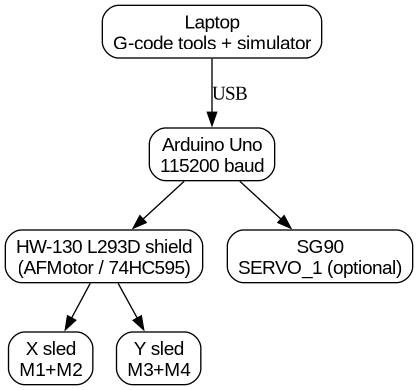

# ESP32 / Uno DVD Pen Plotter

DVD-drive sleds on an **HW-130 L293D** shield. **Active path: Arduino Uno +
AFMotor.** ESP32 firmware is kept for a later migration.

| Doc | Contents |
| --- | --- |
| [`docs/STATUS.md`](docs/STATUS.md) | Done vs left checklist |
| [`docs/ARCHITECTURE.md`](docs/ARCHITECTURE.md) | How the system fits together |
| [`FINDINGS.md`](FINDINGS.md) | Measured bed, steps/mm, coil ohms |
| [`hardware/WIRING.md`](hardware/WIRING.md) | ESP32 bypass wiring (deferred) |
| [`BUILD.md`](BUILD.md) | Original ESP32 build narrative |




## Current state

- Firmware: [`src/uno_plotter`](src/uno_plotter) @ **115200** baud  
- Bed: **55 × 50 mm** · steps/mm: **2.058** (ruler-verified)  
- Preview: `python3 sim/simulate.py job.gcode --paper`  
- CAD: [`cad/plotter.scad`](cad/plotter.scad)  

## Uno quick start

1. Shield on Uno; X on M1/M2, Y on M3/M4; park sleds at the **paper corner**.
2. Flash and plot:

```bash
arduino-cli compile -b arduino:avr:uno src/uno_plotter
arduino-cli upload  -b arduino:avr:uno -p /dev/ttyACM0 src/uno_plotter

python3 sim/simulate.py test-square-uno.gcode --paper --out sim/out/page.png
tools/send_gcode.py -p /dev/ttyACM0 -b 115200 test-square-uno.gcode
```

## Making G-code

| Tool | Use |
| --- | --- |
| [`tools/text2gcode.py`](tools/text2gcode.py) | Hershey single-stroke text |
| [`tools/handwriting2gcode.py`](tools/handwriting2gcode.py) | Neural handwriting |
| [`tools/image2gcode.py`](tools/image2gcode.py) | Bitmap → outlines |
| [`tools/send_gcode.py`](tools/send_gcode.py) | USB stream |

## What is left

Only hardware consumables / optional upgrades — see
[`docs/STATUS.md`](docs/STATUS.md). Software, simulation, CAD, and docs for the
Uno path are complete.
