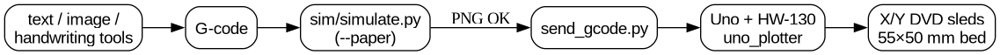

# ESP32 / Uno DVD Pen Plotter

DVD-drive sleds on an **HW-130 L293D** shield. Both boards are supported in
separate folders — swap hardware, keep the same G-code tools.

| Doc | Contents |
| --- | --- |
| [`docs/STATUS.md`](docs/STATUS.md) | Done vs left checklist |
| [`docs/ARCHITECTURE.md`](docs/ARCHITECTURE.md) | How the system fits together |
| [`FINDINGS.md`](FINDINGS.md) | Measured bed, steps/mm, coil ohms |
| [`hardware/WIRING.md`](hardware/WIRING.md) | **ESP32 jumper wiring** (no soldering) |
| [`cad/pcb/`](cad/pcb/) | **ESP32↔HW-130 adapter PCB** (Uno-style stack + Gerbers) |
| [`src/README.md`](src/README.md) | Firmware folder map |



## Firmware folders

| Path | Board |
| --- | --- |
| [`src/uno/uno_plotter`](src/uno/uno_plotter/) | Arduino Uno (shield stacked) |
| [`src/esp32/esp32_plotter`](src/esp32/esp32_plotter/) | ESP32 (jumpers into shield headers) |

Bed: **55 × 50 mm** · steps/mm: **2.058** · baud: **115200**

## ESP32 quick start (current focus)

1. Shield **off** the Uno. Power shield `5V`+`GND` and `EXT_PWR` (yellow jumper
   off). Common GND with ESP32. See [`hardware/WIRING.md`](hardware/WIRING.md).
2. Eight jumpers: D12/D4/D7/D8 + D11/D3/D6/D5 → ESP32 GPIOs in the wiring table.
3. Flash and test:

```bash
arduino-cli compile -b esp32:esp32:esp32 src/esp32/esp32_plotter
arduino-cli upload  -b esp32:esp32:esp32 -p /dev/ttyUSB0 src/esp32/esp32_plotter

# USB serial: $COILTEST then raise $POWER= if needed
tools/send_gcode.py -p /dev/ttyUSB0 -b 115200 test-square-uno.gcode
```

Wi-Fi hotspot `DVD-Plotter` / `plotter123` → draw in the browser.

## Uno quick start

```bash
arduino-cli compile -b arduino:avr:uno src/uno/uno_plotter
arduino-cli upload  -b arduino:avr:uno -p /dev/ttyACM0 src/uno/uno_plotter
tools/send_gcode.py -p /dev/ttyACM0 -b 115200 test-square-uno.gcode
```

## Making G-code

| Tool | Use |
| --- | --- |
| [`tools/text2gcode.py`](tools/text2gcode.py) | Hershey single-stroke text |
| [`tools/handwriting2gcode.py`](tools/handwriting2gcode.py) | Neural handwriting |
| [`tools/image2gcode.py`](tools/image2gcode.py) | Bitmap → outlines |
| [`tools/send_gcode.py`](tools/send_gcode.py) | USB stream |
| `python3 sim/simulate.py job.gcode --paper` | Paper preview |
