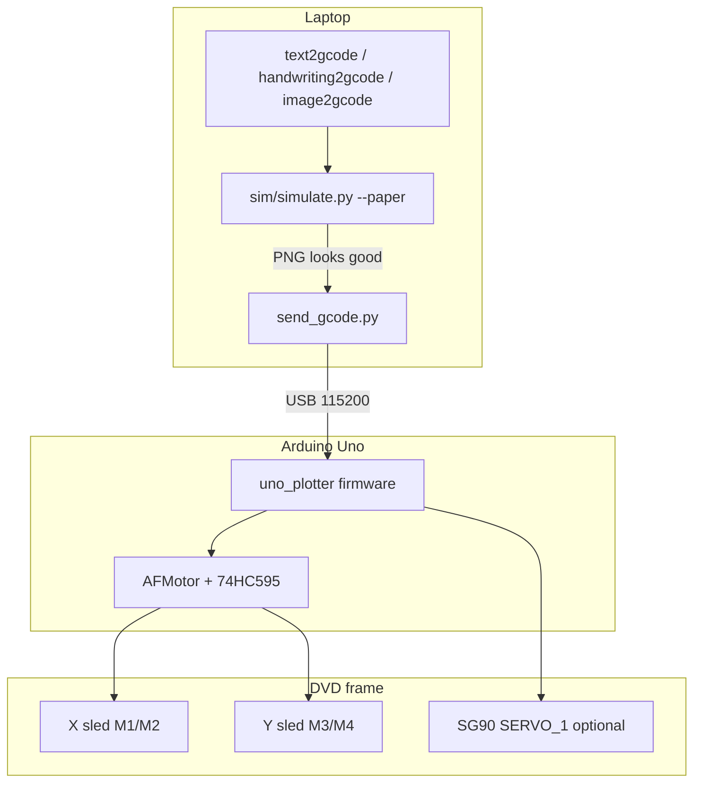
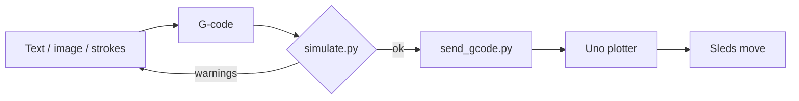
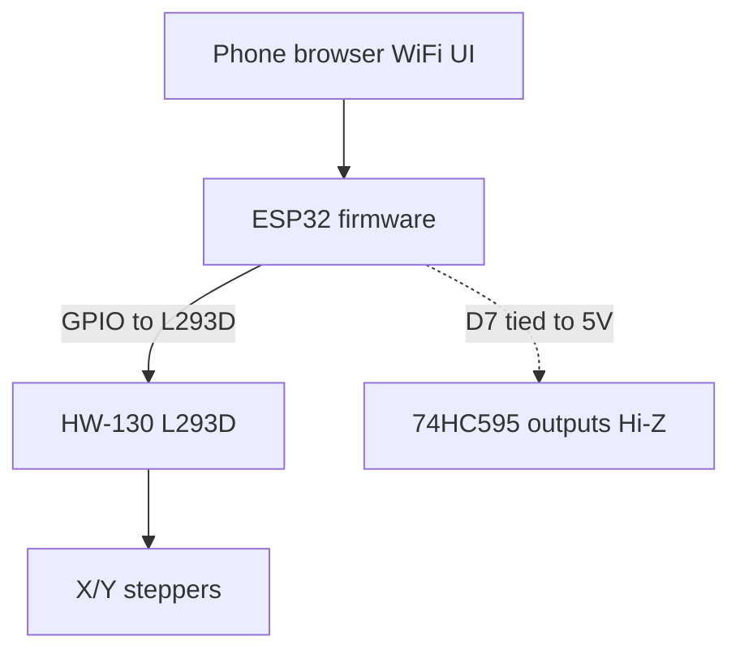

# Architecture

How the pieces connect on the **current Uno path**, and what is deferred.

## System overview



## Software pipeline



## Coordinate system

```text
Y 50 mm
^
|
|   paper / bed 55 × 50 mm
|
+--------------> X 55 mm
(0,0) = corner where sleds are parked at power-on / G92
```

Origin is a **corner**, not the middle of the rails.

## Firmware roles

| Sketch | Baud | Use |
| --- | --- | --- |
| `src/uno_motor_test` | 9600 | Manual jog / wiring bring-up |
| `src/uno/uno_plotter` | 115200 | Uno + stacked HW-130 |
| `src/esp32/esp32_plotter` | 115200 + WiFi | ESP32 jumpers → 74HC595 (no solder) |

## Deferred ESP32 path



Do not start this until Uno ink plots are satisfactory. Tying `D7`→`5V`
disables the stock AFMotor path.

## CAD vs simulation

| Artifact | Answers |
| --- | --- |
| `cad/plotter.scad` | Will the frame / pen bracket fit? |
| `sim/simulate.py` | Will this G-code fit the bed and look right? |
| `sim/spice/` | Is coil current safe at a given step rate? |
| Watching sleds (no pen) | Do motors move / directions correct? |

Ink appearance without paper ≈ `simulate.py --paper`.
